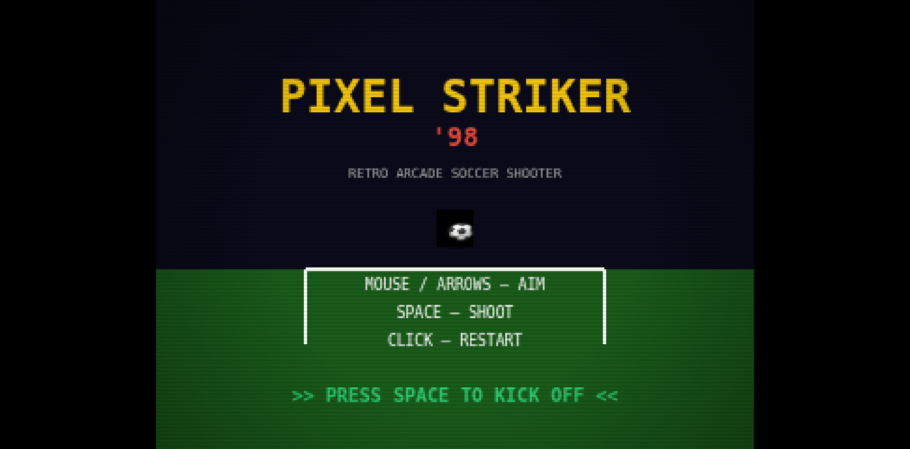
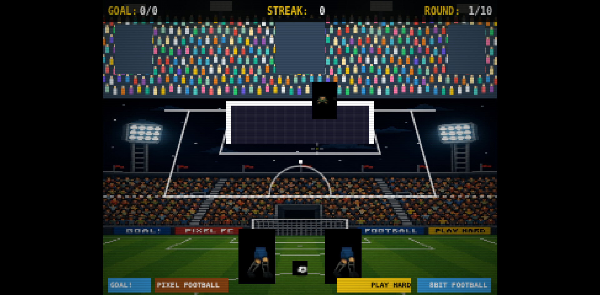
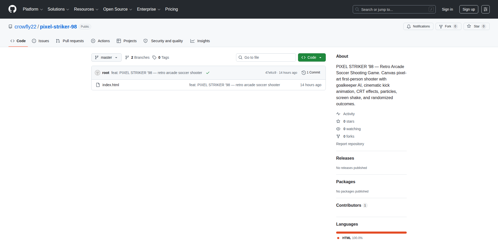

# PIXEL STRIKER '98

<div align="center">

```
██████╗ ██╗██╗  ██╗███████╗██╗         ███████╗████████╗██████╗ ██╗██╗  ██╗███████╗██████╗ 
██╔══██╗██║╚██╗██╔╝██╔════╝██║         ██╔════╝╚══██╔══╝██╔══██╗██║██║ ██╔╝██╔════╝██╔══██╗
██████╔╝██║ ╚███╔╝ █████╗  ██║         ███████╗   ██║   ██████╔╝██║█████╔╝ █████╗  ██████╔╝
██╔═══╝ ██║ ██╔██╗ ██╔══╝  ██║         ╚════██║   ██║   ██╔══██╗██║██╔═██╗ ██╔══╝  ██╔══██╗
██║     ██║██╔╝ ██╗███████╗███████╗    ███████║   ██║   ██║  ██║██║██║  ██╗███████╗██║  ██║
╚═╝     ╚═╝╚═╝  ╚═╝╚══════╝╚══════╝    ╚══════╝   ╚═╝   ╚═╝  ╚═╝╚═╝╚═╝  ╚═╝╚══════╝╚═╝  ╚═╝
                                     '98
```

**Retro Arcade Soccer Shooting Game**

*First-person pixel-art penalty shootout with AI goalkeeper, CRT effects, and cinematic kick animation*

[](https://crowfly22.github.io/pixel-striker-98/)
[](https://opensource.org/licenses/MIT)
[](https://developer.mozilla.org/en-US/docs/Web/API/Canvas_API)
[](https://developer.mozilla.org/en-US/docs/Web/JavaScript)
[](https://100t.xiaomimimo.com/)

</div>

---

## Overview

PIXEL STRIKER '98 is a retro-styled arcade soccer game built entirely with vanilla JavaScript and HTML5 Canvas. Take penalty kicks against an intelligent AI goalkeeper with dynamic difficulty adjustment, cinematic camera effects, and authentic CRT scanline rendering.

**Built for MiMo 100T Token Creator Incentive Program** — Powered by MiMo V2.5 Pro from Xiaomi.

---

## Features

### Gameplay
- **First-person penalty kicks** — Aim with mouse/keyboard, shoot with SPACE
- **AI goalkeeper** — Dynamic difficulty that adapts to your streak
- **5 shot outcomes** — GOAL, SAVE, POST, MISS, CURVED
- **Combo system** — Build streaks for bonus effects
- **Randomized outcomes** — No two shots feel the same

### Visual Effects
- **CRT scanlines** — Authentic retro monitor simulation
- **RGB shift** — Chromatic aberration on impact
- **Pixel art** — 400×300 native resolution, crisp-edges rendering
- **Particle system** — Sparks on goals, saves, and posts
- **Ball trail** — 15-frame motion trail with curved shot variants
- **Camera shake** — Impact-driven screen shake with decay
- **Camera bob** — Subtle breathing animation during aiming

### Audio
- **Web Audio API** — Procedural sound synthesis
- **Kick sound** — Impact feedback on shoot
- **Goal celebration** — Audio reward on scoring
- **Post/save sounds** — Distinct feedback per outcome

### Controls
| Input | Action |
|-------|--------|
| Mouse | Aim crosshair |
| Arrow Keys | Aim (keyboard) |
| SPACE | Shoot |
| Click | Restart (after game over) |

---

## Architecture

```
┌─────────────────────────────────────────────────┐
│                   GAME LOOP                      │
├─────────────────────────────────────────────────┤
│  MENU → AIMING → KICKING → FLIGHT → RESULT      │
│                                                   │
│  ┌──────────┐  ┌──────────┐  ┌──────────┐       │
│  │ Renderer │  │ Physics  │  │   AI     │       │
│  │ (Canvas) │  │ (Ball)   │  │(Keeper)  │       │
│  └──────────┘  └──────────┘  └──────────┘       │
│       │              │              │             │
│       └──────────────┼──────────────┘             │
│                      │                            │
│              ┌───────────────┐                    │
│              │  Game State   │                    │
│              │  Management   │                    │
│              └───────────────┘                    │
└─────────────────────────────────────────────────┘
```

### State Machine
```
MENU ──click──→ AIMING ──SPACE──→ KICKING ──→ FLIGHT ──→ RESULT
  ↑                                              │         │
  └──────────────── click ───────────────────────┴─────────┘
                                                    (GAMEOVER)
```

---

## Technical Details

| Component | Implementation |
|-----------|---------------|
| Rendering | HTML5 Canvas 2D, 400×300 native |
| Scaling | `devicePixelRatio` aware, letterbox fit |
| Audio | Web Audio API, procedural synthesis |
| Input | Mouse + Keyboard (arrow keys) |
| State | Finite state machine (6 states) |
| AI | Goalkeeper prediction with randomized offset |
| Effects | CRT scanlines, RGB shift, particles, shake |
| Sprite | Pixel art goalkeeper with leg animation |

### Goalkeeper AI
The goalkeeper uses a prediction system:
1. Tracks ball position during flight
2. Calculates intercept trajectory
3. Adds randomized offset (difficulty scaling)
4. Diving animation with leg extension

### CRT Effect Pipeline
```
Canvas → Scanlines (horizontal lines)
       → Vignette (corner darkening)
       → Noise (random pixel flicker)
       → RGB Shift (chromatic aberration on shake)
```

---

## Screenshots

<div align="center">

| Landing | Gameplay |
|---------|----------|
|  |  |

| GitHub Repo |
|-------------|
|  |

</div>

---

## Quick Start

### Play Online
```
https://crowfly22.github.io/pixel-striker-98/
```

### Run Locally
```bash
# Clone
git clone https://github.com/crowfly22/pixel-striker-98.git
cd pixel-striker-98

# Open in browser
open index.html
# or
python3 -m http.server 8080
# then visit http://localhost:8080
```

No build tools. No dependencies. Just open `index.html`.

---

## Project Structure

```
pixel-striker-98/
├── index.html          # Complete game (HTML + CSS + JS)
├── README.md           # This file
└── screenshots/        # Game screenshots
    ├── 01-landing.png
    ├── 02-github-repo.png
    └── 03-gameplay.png
```

**Single file architecture** — The entire game is in `index.html` (1,083 lines). No external dependencies, no build step, no framework.

---

## Development

### Built With
- **HTML5 Canvas** — 2D rendering engine
- **Vanilla JavaScript** — Zero dependencies
- **Web Audio API** — Procedural sound
- **CSS** — CRT overlay effects

### Code Highlights
```javascript
// State machine
let state = 'MENU'; // MENU, AIMING, KICKING, FLIGHT, RESULT, GAMEOVER

// Camera shake with decay
camShake *= camShakeDecay;

// Particle system
function spawnParticles(x, y, count, color, speed = 2) {
    for (let i = 0; i < count; i++) {
        particles.push({
            x, y,
            vx: (Math.random() - 0.5) * speed * 2,
            vy: (Math.random() - 0.5) * speed * 2,
            life: 1,
            color,
            size: Math.random() * 3 + 1
        });
    }
}

// CRT scanline effect
for (let i = 0; i < H; i += 2) {
    G.fillStyle = `rgba(0,0,0,${crtIntensity * 0.3})`;
    G.fillRect(0, i, W, 1);
}
```

---

## MiMo 100T Submission

This project was built for the **MiMo 100T Token Creator Incentive Program**.

### Tools Used
- **Claude Code** — Code generation and optimization
- **Hermes Agent** — Deployment automation
- **Cursor** — IDE and debugging

### Models Used
- **Claude** — Architecture design and code review
- **MiMo V2.5 Pro** — Game logic optimization and AI behavior

### Multi-Agent Architecture
```
┌──────────────┐     ┌──────────────┐     ┌──────────────┐
│  Composer    │────→│  Renderer    │────→│  AI Agent    │
│  Agent       │     │  Agent       │     │  (Keeper)    │
│              │     │              │     │              │
│ Game logic   │     │ CRT effects  │     │ Dynamic      │
│ State mgmt   │     │ Particles    │     │ difficulty   │
│ Physics      │     │ Audio        │     │ Prediction   │
└──────────────┘     └──────────────┘     └──────────────┘
```

---

## License

MIT License — Copyright (c) 2026 crowfly22

---

## Acknowledgments

- **MiMo V2.5 Pro** from Xiaomi — AI-powered game logic
- **100T Token Creator Incentive Program** — https://100t.xiaomimimo.com/
- **CRT aesthetic** inspired by 90s arcade cabinets
- **Pixel art** style致敬 classic football games

---

<div align="center">

**Built with MiMo V2.5 Pro** | **Powered by Xiaomi**

[](https://100t.xiaomimimo.com/)

</div>
